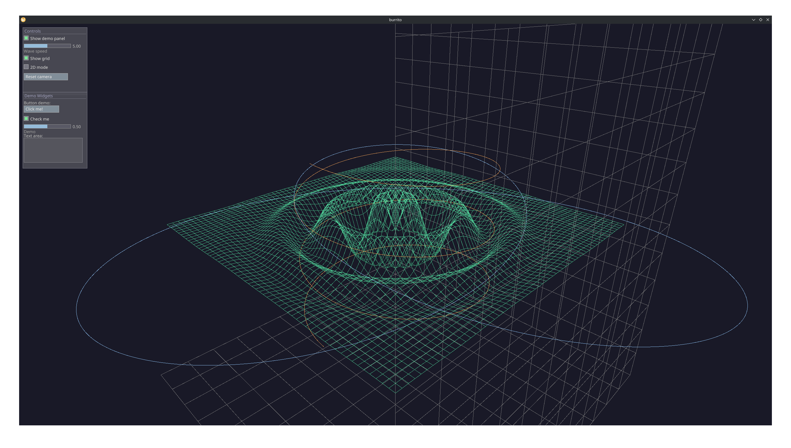

# burrito

A real-time 2D/3D plotting and visualization library in Rust, powered by `wgpu`.


## Features

### 3D Plots
- **Wireframe surfaces** — colored height-map surfaces from `f(x, z)`
- **Animated surfaces** — time-varying `f(x, z, t)` with per-frame GPU updates
- **Parametric curves** — static and time-animated 3D curves
- **Scatter plots** — 3D point clouds
- **Reference grid** — axis-aligned bounding-box grid

### 2D Plots
- Line plots, scatter plots, bar charts
- Fill-between, step, and stem plots
- Configurable axes with spines, ticks, and grid lines

### Canvas2D
An HTML5 Canvas 2D-like drawing API:
- Paths (`moveTo`, `lineTo`, `closePath`, `fill`, `stroke`)
- Shapes (`arc`, `rect`, `fillRect`, `strokeRect`)
- Configurable fill/stroke colors and line width

### Immediate-Mode GUI
- Button, checkbox, slider, multi-line text area, labeled group containers
- GPU-accelerated overlay rendering with alpha blending

### Camera
- Orbital 3D camera (yaw/pitch/radius via left-drag, middle-drag to pan)
- 2D orthographic mode toggle
- Scroll to zoom (Ctrl+scroll zooms even with the text area focused)

## Controls

| Input | Action |
|-------|--------|
| Left-click + drag | Orbit camera |
| Middle-click + drag | Pan camera |
| Scroll | Zoom camera / scroll text area |
| Ctrl + scroll | Zoom camera (when text area focused) |

## Build

```sh
cargo build --release
cargo run --release
```

### Dependencies

- [wgpu](https://wgpu.rs/) — GPU rendering (Vulkan/Metal/DX12)
- [winit](https://github.com/rust-windowing/winit) — windowing and input
- [glyphon](https://github.com/grovesNL/glyphon) — text rendering
- [glam](https://github.com/bitshifter/glam) — linear algebra
- [bytemuck](https://github.com/Lokathor/bytemuck) — safe byte casting for GPU buffers
